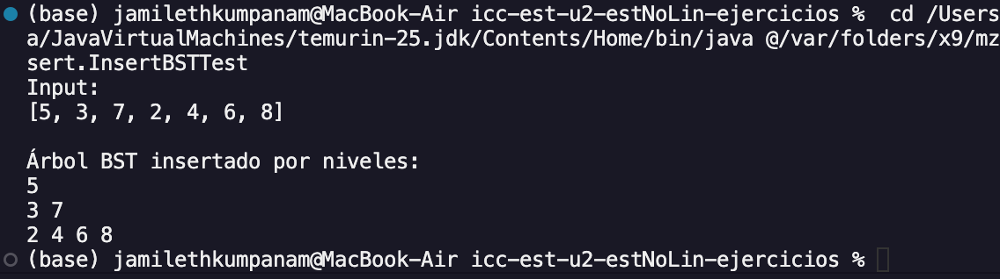
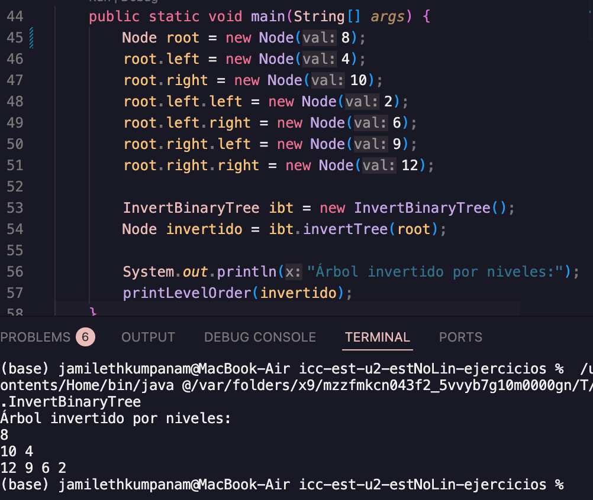
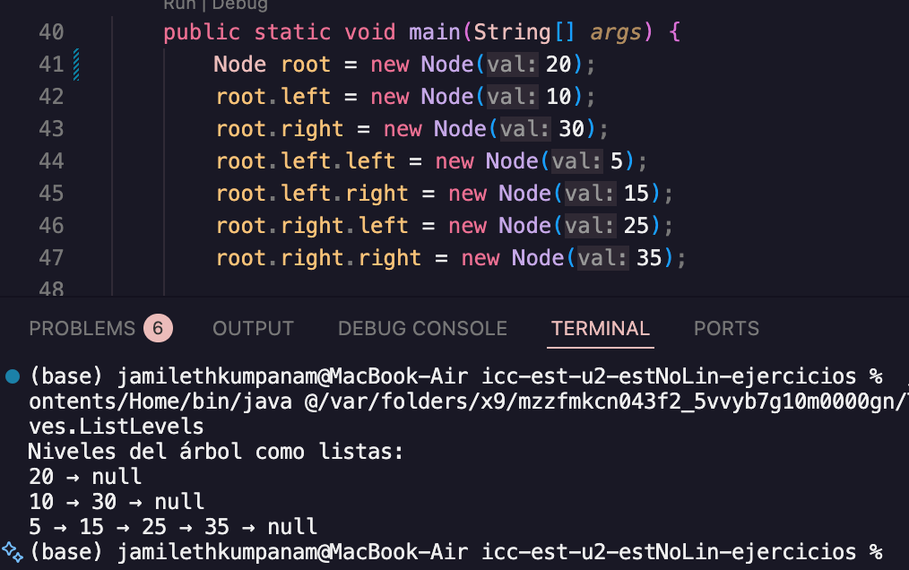
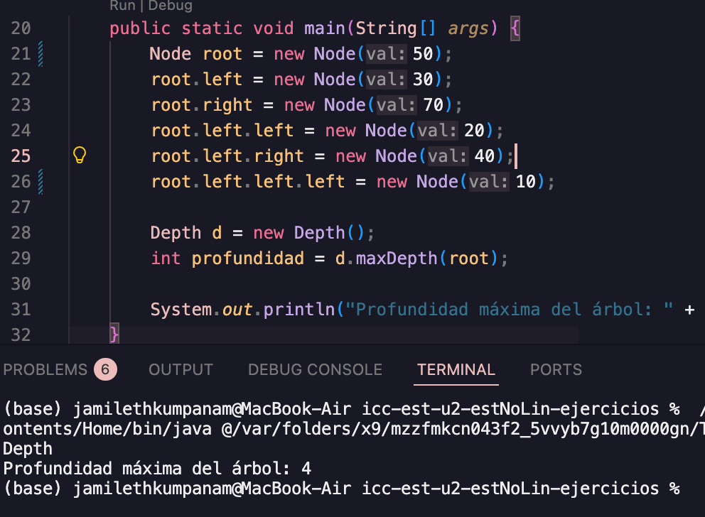

# Estructura de Datos

--
### **Asignatura:** Estructura de Datos
---
# Estudiante:
- Jamileth Estefania Kumpanam Segarra - [Enlace a GitHub](https://github.com/jamileth-kumpanam)

## Práctica: Ejercicios de Lógica con Árboles

El objetivo principal de este proyecto es dominar la manipulación de estructuras de datos no lineales, específicamente árboles binarios, mediante la implementación de algoritmos fundamentales que resuelven problemas de organización, transformación y recorrido de datos.

### Objetivos Principales
#### Dominio de la Lógica de Árboles (BST)
El objetivo es comprender la propiedad de orden de los Árboles Binarios de Búsqueda. Al implementar la inserción, aprendemos cómo estructurar datos de manera jerárquica para optimizar búsquedas.
#### Gestión de Memoria y Estructuras Híbridas
Al listar niveles en listas enlazadas, el objetivo es aprender a conectar dos estructuras distintas. Capaz de recorrer el árbol y transferir esos datos a una estructura lineal (lista enlazada) preservando el orden jerárquico.

### Tabla de Contenidos

src/

├── Ejercicio_01_insert

├── Ejercicio_02_invert

├── Ejercicio_03_listLevels

└── Ejercicio_04_depth
- Ejecución

## Ejercicio 01: Insertar en un Árbol Binario de Búsqueda (BST)
Carpeta: Ejercicio_01_insert

Este ejercicio construye un Árbol Binario de Búsqueda insertando valores uno por uno y luego muestra el árbol por niveles.

Un BST cumple la regla:

Los valores menores al nodo van a la izquierda

Los valores mayores o iguales van a la derecha
### ¿Qué demuestra este ejercicio?

* Uso de recursividad
* Manejo de estructuras de datos (árboles y colas)
* Comprensión del BST
* Inserción ordenada
* Recorrido por niveles

- ### Evidencia de Ejecución

## Ejercicio 02: Invertir un Árbol Binario
Carpeta: Ejercicio_02_invert

Este ejercicio invierte un árbol binario, es decir:

El hijo izquierdo de cada nodo pasa a ser hijo derecho

El hijo derecho pasa a ser hijo izquierdo

Esto se hace recursivamente desde la raíz hasta las hojas.

Este ejercicio toma un árbol binario y genera su versión invertida, intercambiando los hijos de cada nodo de forma recursiva. El resultado es un árbol espejo que mantiene la misma estructura, pero reflejada.

### ¿Qué demuestra este ejercicio?

* Uso de recursividad
* Manipulación de punteros/referencias
* Comprensión de árboles binarios
* Aplicación de recorridos por niveles
* Concepto de árbol espejo

- ### Evidencia de Ejecución

## Ejercicio 03: Listar Niveles en Listas Enlazadas
Carpeta: Ejercicio_03_listLevels

Este ejercicio recorre un árbol binario por niveles y crea una lista enlazada para cada nivel del árbol.

Si el árbol tiene N niveles, el algoritmo devuelve N listas, donde:

La primera lista contiene la raíz

La segunda lista contiene los nodos del nivel 1

Y así sucesivamente hasta el último nivel

### ¿Qué demuestra este ejercicio?

* Recorrido BFS (Breadth-First Search)
* Uso de colas (Queue)
* Manejo de listas de listas
* Organización de datos por niveles
* Relación entre árboles y listas enlazadas

- ### Evidencia de Ejecución

## Ejercicio 04: Calcular la Profundidad Máxima
Carpeta: Ejercicio_04_depth

Este ejercicio calcula la profundidad máxima (o altura) de un árbol binario.

La profundidad máxima es: El número de nodos que hay en el camino más largo desde la raíz hasta una hoja.

### ¿Qué demuestra este ejercicio?

* Uso de recursividad
* Análisis de árboles binarios
* Comparación de subárboles
* Cálculo de altura/profundidad
* Comprensión de casos base y retorno recursivo

- ### Evidencia de Ejecución

